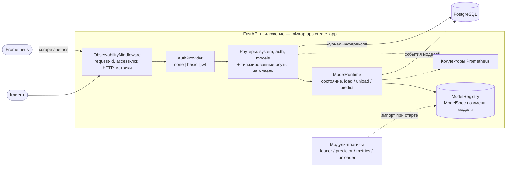
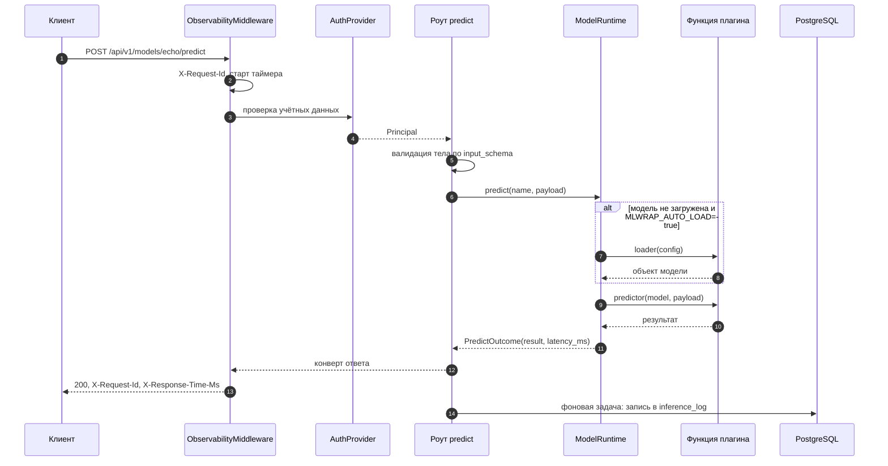

# Справка по проекту mlwrap

`mlwrap` — каркас на FastAPI, в который ML-модель «подкладывается» одним модулем. Вы пишете
до трёх функций — загрузка, инференс, сбор метрик — и регистрируете их в реестре под именем
модели. Всё остальное сервис берёт на себя: HTTP-эндпоинты с выведенными из аннотаций схемами,
аутентификация, метрики Prometheus и журнал запусков в базе.

Эта справка описывает, как сервис устроен внутри:

- **[Модули mlwrap](modules.md)** — назначение каждого пакета, кто от кого зависит,
  жизненный цикл модели.
- **[База данных](database.md)** — таблицы `inference_log` и `model_event`, их связи,
  индексы и расчёт агрегатов.
- **[Метрики Prometheus](metrics.md)** — полный перечень коллекторов, их метки и точки,
  в которых они обновляются.
- **[Проектный документ](DESIGN.md)** — основная идея, ключевые требования и границы проекта.

Практические инструкции (установка, подключение своей модели, переменные окружения, CLI)
живут в [README](https://github.com/MeJustBear/python-ml-service#readme).

## Как собраны слои



Ключевая идея: **реестр отделён от рантайма**. `ModelRegistry` хранит только описания
(`ModelSpec`: функции плюс выведенные из аннотаций схемы) и наполняется в момент импорта
плагинов. `ModelRuntime` добавляет к описанию изменяемое состояние (`ModelHandle`): загружена
ли модель, сколько раз вызвана, какая была последняя ошибка. Благодаря этому разделению
схемы запросов известны ещё до того, как модель загружена, и попадают в OpenAPI на старте.

## Путь одного запроса



Запись в журнал идёт **после** ответа клиенту — через `BackgroundTasks`, — поэтому задержка
инференса не включает в себя обращение к базе. Исключение одно: если инференс упал, ответ
формирует обработчик исключений, до фоновых задач дело не доходит, и строка в журнал пишется
синхронно внутри обработчика ошибки.

## Три уровня наблюдаемости

Сервис измеряет себя в трёх независимых местах, и путать их не стоит — у них разное время
жизни и разная точность.

| Уровень | Где живёт | Что умеет | Переживает рестарт |
|---|---|---|---|
| Коллекторы Prometheus | память процесса, `/metrics` | гистограммы задержек, счётчики, gauge состояния | нет (но Prometheus хранит ряды) |
| Счётчики `ModelHandle` | память процесса, `/api/v1/models/{name}/metrics` | число вызовов, ошибок, средняя и последняя задержка | нет |
| Журнал `inference_log` | PostgreSQL | история вызовов, доля ошибок, перцентили по окну | да |

База опциональна. Без `MLWRAP_DATABASE_URL` сервис работает полностью, просто без истории
и агрегатов по ней; `/health/ready` в этом случае сообщает `database: disabled`.

## Запуск за пять минут

```bash
pdm install
pdm run mlwrap serve          # http://localhost:8000/docs

curl -s -X POST localhost:8000/api/v1/models/echo/predict \
     -H 'Content-Type: application/json' \
     -d '{"text": "привет", "repeat": 2}'
```

Со всей инфраструктурой — `docker compose up --build`: поднимутся `api` (8000),
`postgres` (5433 снаружи) и `prometheus` (9090, скрейпит `api:8000/metrics`).
