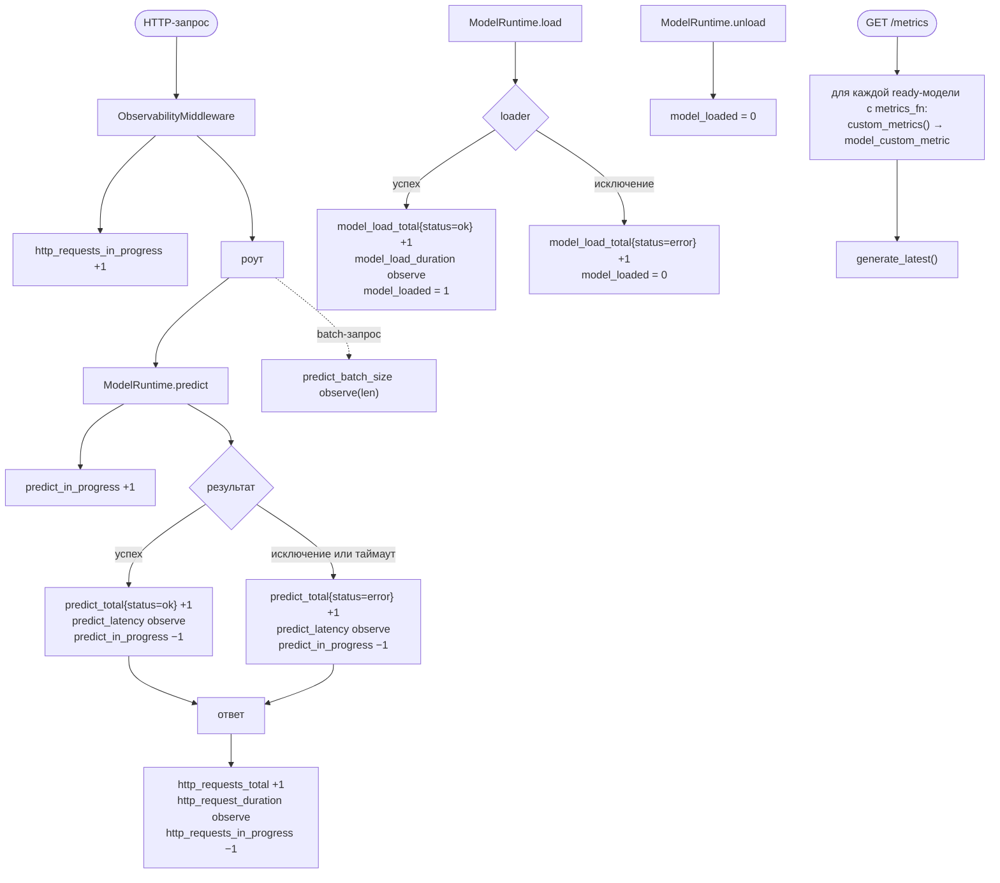
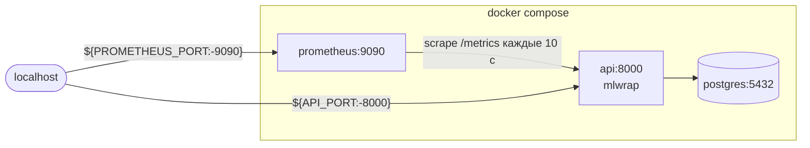

# Метрики Prometheus

Все коллекторы объявлены на уровне модуля `mlwrap/observability/metrics.py`, то есть
регистрируются в дефолтном реестре `prometheus_client` ровно один раз за процесс. Отдаёт их
роут `/metrics` (путь настраивается через `MLWRAP_METRICS_PATH`).

Метрики делятся на четыре группы: инференс, жизненный цикл моделей, пользовательские метрики
плагинов и HTTP-слой. Плюс одна информационная.

## Полный перечень

### Инференс

| Метрика | Тип | Метки | Что измеряет |
|---|---|---|---|
| `mlwrap_predict_total` | Counter | `model`, `status` | число вызовов инференса; `status` — `ok` или `error` |
| `mlwrap_predict_latency_seconds` | Histogram | `model` | длительность одного вызова `predictor`, в секундах |
| `mlwrap_predict_in_progress` | Gauge | `model` | сколько инференсов выполняется прямо сейчас |
| `mlwrap_predict_batch_size` | Histogram | `model` | длина списка в пакетном запросе |

Бакеты задержки (`LATENCY_BUCKETS`, те же у HTTP-гистограммы) — от миллисекунды до минуты:

```
0.001  0.005  0.01  0.025  0.05  0.1  0.25  0.5  1.0  2.5  5.0  10.0  30.0  60.0
```

Верхняя граница совпадает со значением `MLWRAP_PREDICT_TIMEOUT_SECONDS` по умолчанию: всё,
что упало в `+Inf`, — это уже таймаут.

Бакеты размера пакета: `1 2 5 10 25 50 100 250 500 1000`.

### Жизненный цикл моделей

| Метрика | Тип | Метки | Что измеряет |
|---|---|---|---|
| `mlwrap_model_loaded` | Gauge | `model` | `1` — модель в состоянии `ready`, `0` — любое другое |
| `mlwrap_model_load_total` | Counter | `model`, `status` | число попыток загрузки; `status` — `ok` или `error` |
| `mlwrap_model_load_duration_seconds` | Histogram | `model` | длительность успешной загрузки |

Бакеты загрузки — другие, потому что речь о другом порядке величин:
`0.01 0.1 0.5 1.0 5.0 15.0 60.0 300.0`.

`mlwrap_model_loaded` появляется со значением `0` в момент создания `ModelHandle`, то есть при
первом обращении к модели через рантайм. Это важно для алертов: пока модель ни разу не
трогали, ряда может просто не быть, и `mlwrap_model_loaded == 0` ничего не найдёт.

### Пользовательские метрики плагинов

| Метрика | Тип | Метки | Что измеряет |
|---|---|---|---|
| `mlwrap_model_custom_metric` | Gauge | `model`, `metric` | то, что вернула функция `@registry.metrics` |

Каждый ключ словаря становится значением метки `metric`. Для `iris` из примеров это даст:

```
mlwrap_model_custom_metric{model="iris",metric="test_accuracy"} 0.9666666666666667
mlwrap_model_custom_metric{model="iris",metric="n_estimators"} 100.0
mlwrap_model_custom_metric{model="iris",metric="n_features"} 4.0
```

Нечисловые значения отбрасываются: `publish_custom_metrics()` пробует `float(value)` и молча
пропускает всё, что не приводится, а `ModelRuntime.custom_metrics()` ещё раньше логирует
предупреждение `model.metric_not_numeric`. Поэтому держите в словаре только числа — метка
с текстовым значением в Prometheus всё равно не поедет.

### HTTP-слой

| Метрика | Тип | Метки | Что измеряет |
|---|---|---|---|
| `mlwrap_http_requests_total` | Counter | `method`, `path`, `status` | число запросов |
| `mlwrap_http_request_duration_seconds` | Histogram | `method`, `path` | полное время обработки, включая middleware |
| `mlwrap_http_requests_in_progress` | Gauge | — | запросы в обработке, по всему сервису |

Метка `path` — это **шаблон маршрута**, а не конкретный URL. `_route_path()` берёт
`request.scope["route"].path`, поэтому в метриках вы увидите
`/api/v1/models/{model_name}/predict`, а не `/api/v1/models/echo/predict`. Без этого
кардинальность метрик росла бы с числом разных путей. Запрос, не попавший ни в один маршрут
(в том числе 404), получает `path="unmatched"`.

Исключение — модели, известные на старте: у них есть собственные типизированные роуты, и
метка `path` будет содержать конкретное имя, например `/api/v1/models/echo/predict`.

### Информация о сервисе

| Метрика | Тип | Метки | Что измеряет |
|---|---|---|---|
| `mlwrap_app_info` | Gauge | `version`, `environment`, `auth_mode` | всегда `1`, нужна ради меток |

Выставляется один раз в конце `create_app()`. Классический приём: версию и режим запуска
удобно джойнить к другим метрикам по `instance`.

Помимо перечисленного, `/metrics` отдаёт стандартные коллекторы `prometheus_client`:
`python_info`, `python_gc_*` и, на Linux, `process_*` (`process_resident_memory_bytes`,
`process_cpu_seconds_total`, `process_start_time_seconds`). Мы их не объявляем — они приходят
вместе с дефолтным реестром, но вполне годятся для алертов на память и рестарты.

## Где метрики обновляются



Четыре неочевидных момента:

1. **Задержка упавшего вызова всё равно попадает в гистограмму.** `_record_failure()` вызывает
   `PREDICT_LATENCY.observe()` наравне с успешным путём. Значит
   `histogram_quantile` по `mlwrap_predict_latency_seconds` смешивает успехи и ошибки —
   если нужны чистые успехи, считайте перцентили по
   [журналу в БД](database.md#агрегаты-для-api), он фильтрует по `status='ok'`.
2. **Пакетный запрос считается поэлементно.** `predict_batch()` вызывает `predict()` в цикле,
   поэтому запрос из 50 элементов даёт +50 к `mlwrap_predict_total` и 50 наблюдений задержки
   (каждое — по одному элементу). Сам факт пакета фиксирует только
   `mlwrap_predict_batch_size`. В `inference_log` при этом ляжет одна строка с
   `batch_size=50` и задержкой всего пакета — расхождение между двумя источниками здесь
   нормально и ожидаемо.
3. **Пользовательские метрики обновляются на скрейпе.** Роут `/metrics` перед рендером
   обходит все готовые модели, у которых есть `metrics_fn`, и зовёт `custom_metrics()`.
   Поэтому значения всегда свежие на момент сбора, но и функция `metrics` плагина
   вызывается при каждом скрейпе — держите её дешёвой, без обращений к диску и сети.
   Тот же вызов происходит при `GET /api/v1/models/{name}/metrics`.
4. **Загрузка без `loader` не попадает в счётчики загрузки.** Если у модели нет `loader`,
   она считается всегда готовой: `load()` сразу ставит `model_loaded = 1`, но
   `model_load_total` и `model_load_duration_seconds` не трогает.

## Сбор и доступ



Конфиг сбора — `deploy/prometheus/prometheus.yml`: `scrape_interval: 10s`, внешняя метка
`service: mlwrap`, две цели — `api:8000` (job `mlwrap-api`, с меткой `instance: mlwrap-api`)
и сам Prometheus.

Доступ к `/metrics` настраивается двумя переменными:

| Переменная | По умолчанию | Значение |
|---|---|---|
| `MLWRAP_METRICS_ENABLED` | `true` | при `false` роут не регистрируется вообще, а middleware перестаёт считать HTTP-метрики |
| `MLWRAP_METRICS_PATH` | `/metrics` | путь роута |
| `MLWRAP_METRICS_PROTECTED` | `false` | при `true` на роут навешивается та же аутентификация, что на остальное API |

По умолчанию эндпоинт открыт: в compose его забирает Prometheus изнутри сети, и лишний
секрет там не нужен. Если сервис выставлен наружу — включайте `MLWRAP_METRICS_PROTECTED`.

!!! warning "Один процесс на реестр"
    Мультипроцессный режим `prometheus_client` не настроен. При `MLWRAP_WORKERS > 1` каждый
    воркер uvicorn ведёт собственный набор счётчиков, и скрейп попадёт в случайный из них —
    цифры будут неполными. Для продакшена с несколькими воркерами понадобится
    `PROMETHEUS_MULTIPROC_DIR` и переход на `MultiProcessCollector`; пока же масштабируйтесь
    отдельными контейнерами, у каждого из которых свой `instance`.

## Готовые запросы

RPS и доля ошибок по модели:

```promql
sum by (model) (rate(mlwrap_predict_total[5m]))

sum by (model) (rate(mlwrap_predict_total{status="error"}[5m]))
  / sum by (model) (rate(mlwrap_predict_total[5m]))
```

p95 задержки инференса (помните: успехи и ошибки вместе):

```promql
histogram_quantile(
  0.95,
  sum by (model, le) (rate(mlwrap_predict_latency_seconds_bucket[5m]))
)
```

Средняя задержка — честнее, чем перцентиль по редким данным:

```promql
sum by (model) (rate(mlwrap_predict_latency_seconds_sum[5m]))
  / sum by (model) (rate(mlwrap_predict_latency_seconds_count[5m]))
```

Модели, которые должны быть загружены, но не загружены:

```promql
mlwrap_model_loaded == 0
```

Падения загрузки за последний час и время загрузки:

```promql
increase(mlwrap_model_load_total{status="error"}[1h]) > 0

histogram_quantile(
  0.9,
  sum by (model, le) (rate(mlwrap_model_load_duration_seconds_bucket[1h]))
)
```

Доля 5xx по маршрутам:

```promql
sum by (path) (rate(mlwrap_http_requests_total{status=~"5.."}[5m]))
  / sum by (path) (rate(mlwrap_http_requests_total[5m]))
```

Качество модели из пользовательских метрик, с версией сервиса в метках:

```promql
mlwrap_model_custom_metric{metric="test_accuracy"}
  * on (instance) group_left (version) mlwrap_app_info
```

## Что стоит заалертить

| Условие | Выражение | Почему |
|---|---|---|
| Модель отвалилась | `mlwrap_model_loaded == 0` дольше 5 минут | состояние `failed` или `unloaded` при включённом preload |
| Загрузка падает | `increase(mlwrap_model_load_total{status="error"}[15m]) > 0` | битый артефакт, нет доступа к хранилищу |
| Инференс ошибается | доля `status="error"` выше 1% за 10 минут | регрессия в модели или невалидные данные на входе |
| Задержка выросла | p95 выше вашего SLO | деградация модели или нехватка CPU в пуле потоков |
| Запросы копятся | `mlwrap_predict_in_progress` растёт монотонно | блокирующий `predictor` занял весь пул потоков |
| Сервис перезапускается | `changes(process_start_time_seconds[1h]) > 0` | падения контейнера |

Дашбордов Grafana в проекте нет — это сознательно оставлено за рамками, см.
[проектный документ](DESIGN.md).
