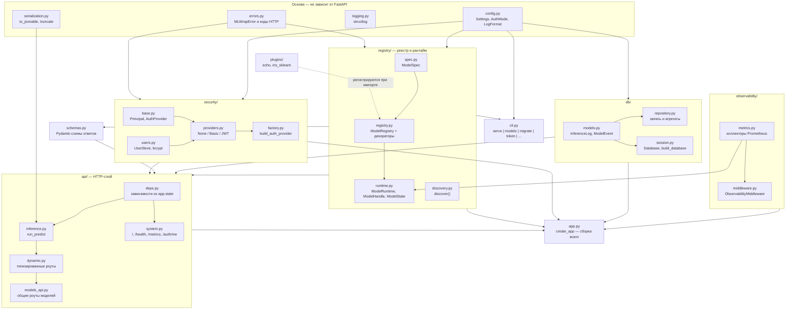
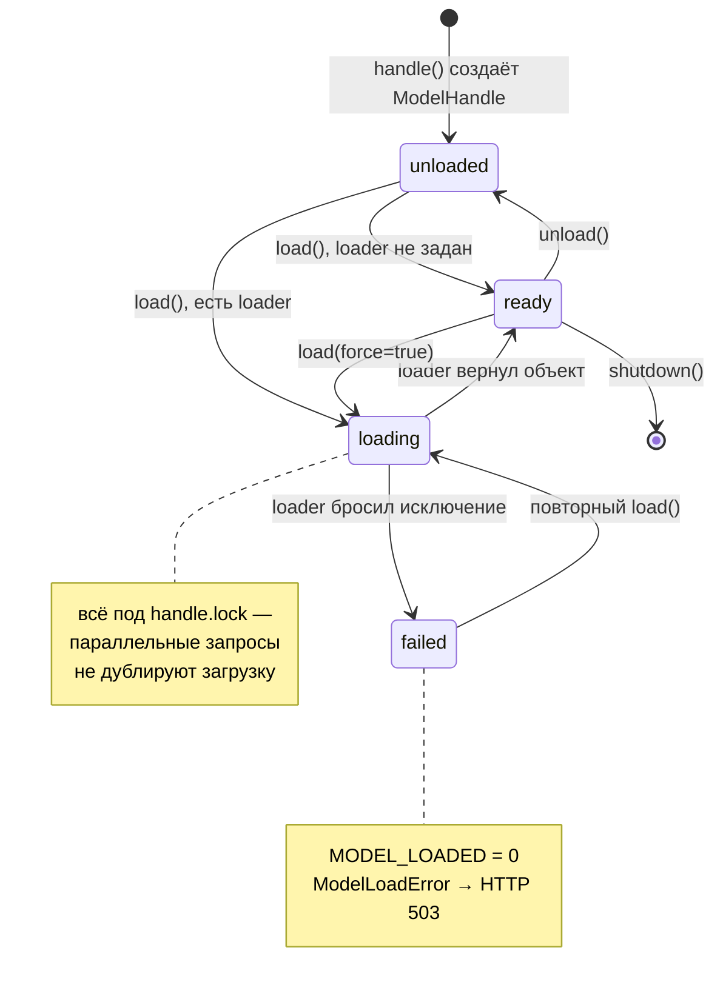
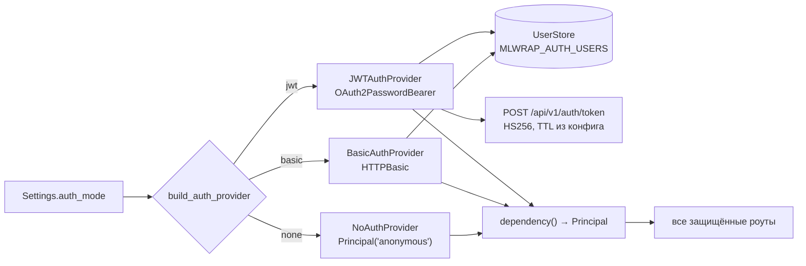
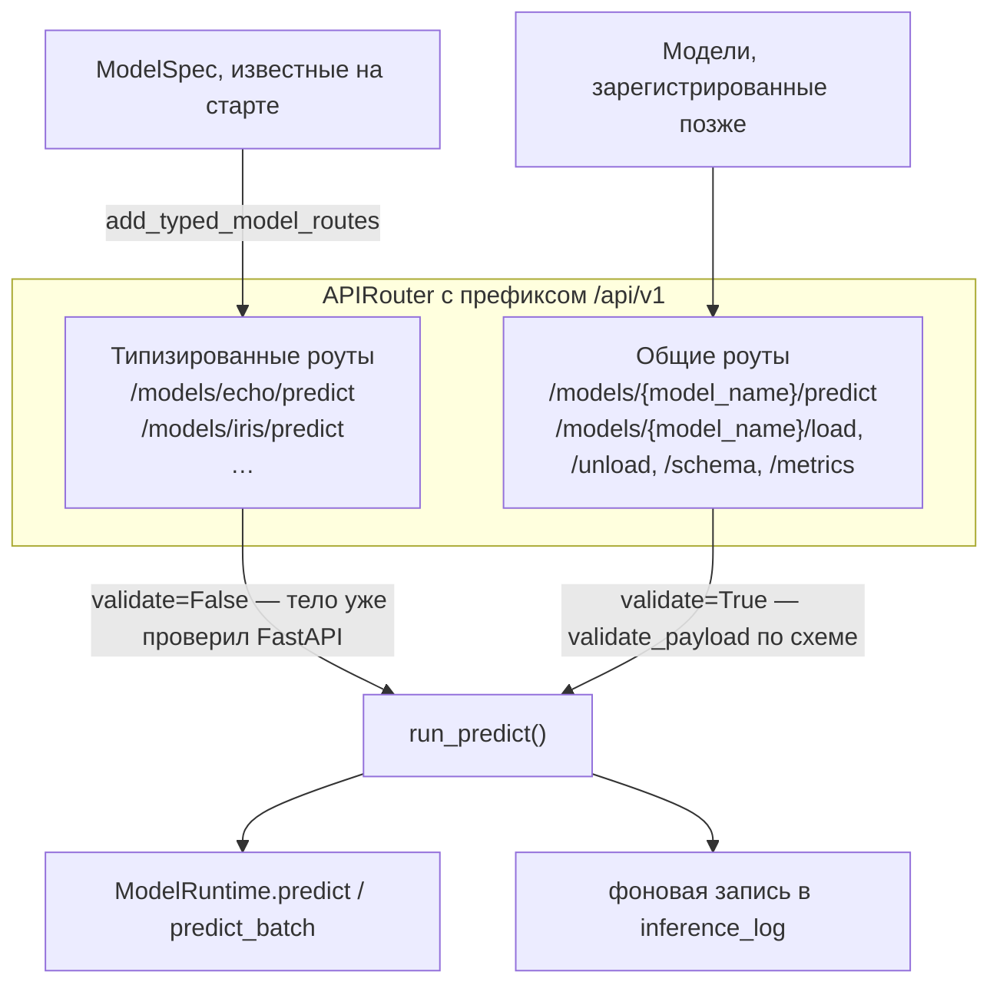
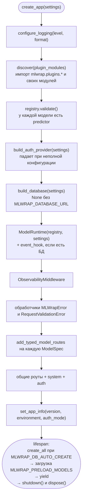

# Модули mlwrap

Пакет лежит в `src/mlwrap` и разбит на пять подпакетов плюс несколько модулей-основ.
Правило, по которому проведены границы: **пользовательский код не должен зависеть ни от чего,
кроме `mlwrap.registry`**. Поэтому реестр не знает ни про FastAPI, ни про базу, ни про
Prometheus, а всё остальное собирается вокруг него в фабрике приложения.

## Карта зависимостей



## Коротко по файлам

| Модуль | Отвечает за |
|---|---|
| `app.py` | фабрика `create_app()`: собирает аутентификацию, реестр, роуты, middleware, БД; `lifespan` с preload и shutdown; обработчики исключений |
| `config.py` | `Settings` на pydantic-settings, префикс `MLWRAP_`, разбор списков и JSON-полей, проверка связки `auth_mode` ↔ пользователи |
| `cli.py` | команды `serve`, `models`, `migrate`, `initdb`, `token`, `hash-password`; флаги транслируются в переменные окружения |
| `errors.py` | иерархия `MLWrapError` с полями `status_code` и `code` — отсюда берутся коды ответов API |
| `schemas.py` | схемы ответов: `ServiceInfo`, `ModelInfo`, `PredictResponse[T]`, `ModelMetricsResponse`, `ErrorResponse` |
| `logging.py` | `configure_logging()`: structlog в консоль или JSON, отключение дублирующего access-лога uvicorn |
| `serialization.py` | `to_jsonable()` — разворачивает pydantic-модели, dataclass'ы, numpy-массивы, `Decimal`, `UUID` в JSON-типы; `truncate()` ограничивает размер записи в БД |

## registry — ядро

Четыре файла, и это единственная часть, которую видит автор модели.

### spec.py

`ModelSpec` — датакласс с описанием модели: `name`, `version`, `description`, `tags`, четыре
необязательные функции (`loader`, `predictor`, `unloader`, `metrics_fn`) и выведенные схемы
`input_schema` / `output_schema`. Методы `loader_wants_config()`, `metrics_wants_model()`,
`unloader_wants_model()` смотрят на сигнатуру через `inspect` — так сервис понимает, передавать
ли функции аргумент. Свойство `is_complete` требует только `predictor`.

### registry.py

`ModelRegistry` — словарь `имя → ModelSpec` и декораторы, которые его наполняют:

| Декоратор | Сигнатура пользовательской функции | Обязателен |
|---|---|---|
| `@registry.loader(name, version=, description=, tags=)` | `(config: dict) -> Any` или `() -> Any` | нет |
| `@registry.predictor(name)` | `(model, payload) -> result` | **да** |
| `@registry.metrics(name)` | `(model) -> dict[str, float]` или `() -> dict` | нет |
| `@registry.unloader(name)` | `(model) -> None` или `() -> None` | нет |

Декораторы независимы: достаточно, чтобы они указывали одно и то же имя модели — `_ensure()`
создаст или дополнит общий `ModelSpec`. Ошибки в сигнатурах ловятся сразу, при импорте модуля:
`loader` с двумя аргументами или `predictor` с одним бросают `ConfigurationError`.

Схемы выводит `_infer_schemas()` через `get_type_hints()`: тип второго аргумента `predictor`
становится схемой запроса, возвращаемый тип — схемой ответа. Если аннотаций нет или они
ссылаются на локальные типы, подставляется свободный JSON (`dict[str, Any]`).

`registry.validate()` вызывается в `create_app()` и падает, если у какой-то модели нет
`predictor` — лучше не стартовать, чем отдавать 500 на первом запросе. Для тех, кому ближе
классы, есть императивный `registry.register(name, predict=..., load=...)`.

Модуль экспортирует глобальный синглтон `registry`, но `create_app(model_registry=...)`
принимает и свой экземпляр — на этом держится изоляция тестов.

### runtime.py

`ModelRuntime` — единственное место, где модели реально вызываются. На каждую модель хранится
`ModelHandle`: состояние, объект модели, время и длительность загрузки, последняя ошибка,
счётчики вызовов и накопленная задержка, персональная `asyncio.Lock`.



Что важно знать про поведение:

- **Синхронные функции не блокируют event loop.** `_call()` проверяет
  `inspect.iscoroutinefunction()` и обычные `def` уводит в пул потоков через
  `anyio.to_thread.run_sync` — типичная ML-библиотека блокирующая.
- **Ленивая загрузка.** `ensure_ready()` при `MLWRAP_AUTO_LOAD=true` (по умолчанию) грузит
  модель на первом `predict`; при `false` отдаёт `ModelNotLoadedError` → HTTP 409.
- **Таймаут.** `predict` обёрнут в `asyncio.wait_for` с `MLWRAP_PREDICT_TIMEOUT_SECONDS`
  (`0` выключает), при срабатывании — `PredictionTimeoutError` → HTTP 504.
- **Пакетный режим прост.** `predict_batch()` вызывает `predict()` в цикле, последовательно.
  Параллелизма внутри пакета нет, зато каждый элемент попадает в счётчики как отдельный вызов.
- **Ошибки метрик не ломают запрос.** `custom_metrics()` перехватывает исключение плагина,
  проверяет, что вернулся словарь, приводит значения к `float` и всё неподходящее просто
  логирует предупреждением.
- **`event_hook`** — необязательный колбэк, через который `app.py` подшивает запись событий
  `load` / `unload` / `load_failed` в таблицу `model_event`. Падение хука тоже только логируется.

### discovery.py

`discover(modules, autodiscover=True)` импортирует модули — сам импорт и выполняет регистрацию.
Сначала перебираются подмодули `mlwrap.plugins` (через `pkgutil.iter_modules`), затем список из
`MLWRAP_PLUGIN_MODULES`. Разница в обработке ошибок принципиальна: встроенный пример, которому
не хватило опциональной зависимости, пропускается с предупреждением (так `iris_sklearn` молча
исчезает без scikit-learn), а неимпортируемый пользовательский модуль роняет старт с
`ConfigurationError` — вы явно просили его подключить.

## security — три режима аутентификации

Режим выбирается один раз в `build_auth_provider()` и дальше живёт как FastAPI-зависимость,
поэтому в Swagger автоматически появляется нужная схема авторизации.



- `base.py` — `Principal` (`subject`, `auth_mode`, `claims`) и протокол `AuthProvider` из двух
  методов: `dependency()` и `router()`.
- `users.py` — `UserStore` поверх `MLWRAP_AUTH_USERS`. Значение может быть и паролем, и
  bcrypt-хешем (распознаётся по префиксу `$2a$`/`$2b$`/`$2y$`). Сравнение паролей —
  `hmac.compare_digest`, и даже для несуществующего логина выполняется фиктивная сверка, чтобы
  время ответа не выдавало, какие логины есть. `hash_password()` — то, что печатает
  `mlwrap hash-password`.
- `providers.py` — три провайдера. У `jwt` токен несёт `sub`, `iat`, `exp`, `iss`; при разборе
  требуются `exp` и `sub`, а истёкший и некорректный токен дают разные сообщения при одном и
  том же 401.
- `factory.py` — выбор по `Settings` и ранние проверки: `basic`/`jwt` без пользователей или
  `jwt` без секрета поднимают `ConfigurationError` на старте. Это сознательно: лучше не
  стартовать, чем пустить всех.

## observability

`metrics.py` объявляет коллекторы на уровне модуля — значит, они регистрируются в
`prometheus_client` ровно один раз за процесс. Полный перечень с метками и бакетами —
в [отдельном разделе](metrics.md).

`middleware.py` — `ObservabilityMiddleware`, который на каждый запрос:

1. берёт `X-Request-Id` из заголовка или генерирует новый, кладёт в `request.state`;
2. привязывает `request_id`, `method`, `path` к контексту structlog, чтобы они попали во все
   записи внутри запроса;
3. замеряет длительность и обновляет HTTP-метрики — в том числе при необработанном исключении,
   где статус считается `500`;
4. возвращает ответ с заголовками `X-Request-Id` и `X-Response-Time-Ms`.

Метка `path` — это **шаблон маршрута**, а не конкретный URL: `_route_path()` берёт
`request.scope["route"].path`, иначе пишет `unmatched`. Без этого метки метрик разрослись бы
до бесконечности на путях с параметрами.

## db

Тонкий слой: таблицы, две функции записи, одна функция агрегатов и обёртка над движком.
Подробности структуры — в разделе [«База данных»](database.md).

- `models.py` — `InferenceLog` и `ModelEvent` на SQLAlchemy 2.0 (`Mapped` / `mapped_column`).
  Тип `JSONType = JSON().with_variant(JSONB(), "postgresql")` даёт JSONB на Postgres и обычный
  JSON на SQLite в тестах.
- `repository.py` — `record_inference()`, `record_model_event()`, `inference_stats()`.
- `session.py` — класс `Database` (engine, sessionmaker, `session()`, `create_all()`,
  `healthcheck()`, `dispose()`) и `build_database()`, возвращающий `None` без
  `MLWRAP_DATABASE_URL`. Параметры пула не выставляются для SQLite, где они не применимы.

## api — HTTP-слой

Самая интересная часть: эндпоинты существуют в двух вариантах одновременно.



Типизированные роуты регистрируются **первыми**: в FastAPI конкретный путь должен выиграть
у шаблонного `{model_name}`. Благодаря им в OpenAPI попадают реальные схемы модели, и Swagger
показывает заполненную форму запроса вместо «любого JSON».

- `deps.py` — четыре зависимости, достающие `settings`, `runtime`, `database` и `request_id`
  из `app.state` / `request.state`.
- `inference.py` — `run_predict()`, общая реализация для обоих вариантов роутов: валидация
  (если нужна), вызов рантайма, сборка конверта ответа, постановка записи в журнал. Там же
  `batch_schema()`, собирающий `list[schema]` для схемы, известной только в рантайме, и
  кешированный `TypeAdapter` (`lru_cache` на 256 схем).
- `dynamic.py` — генератор типизированных эндпоинтов. FastAPI строит схему по сигнатуре
  функции, а тип payload известен только в рантайме, поэтому `endpoint.__signature__`
  подменяется собранной вручную `inspect.Signature`. Здесь же словарь `ERROR_RESPONSES`
  (401, 404, 409, 422, 503, 504), который навешивается и на общие роуты.
- `models_api.py` — общие роуты моделей: список, карточка, схемы, load/unload,
  predict/predict batch, метрики модели.
- `system.py` — `/`, `/health/live`, `/health/ready`, `/metrics`, `/api/v1/auth/me`.
  `/health/ready` проверяет базу через `SELECT 1` и отдаёт `degraded`, если база недоступна
  или какая-то модель в состоянии `failed`. Роут `/metrics` перед рендером обходит готовые
  модели и обновляет пользовательские метрики, так что они всегда свежие на момент скрейпа.

Ответ инференса — конверт, а не «голый» результат:

```json
{
  "model": "echo",
  "version": "1.0.0",
  "latency_ms": 0.167,
  "request_id": "0a8011dd72e94bb183d9606f063b4105",
  "result": { "text": "приветпривет", "length": 12, "calls": 1 }
}
```

У пакетного варианта вместо `result` — `count` и `results`. Задержка видна сразу, без похода
в Prometheus, а `request_id` связывает ответ с логами и строкой в журнале.

## plugins — примеры

- `echo.py` — модель-заглушка для смоук-тестов: возвращает текст, повторённый `repeat` раз,
  умеет искусственную задержку `delay_ms` и отдаёт пользовательскую метрику `calls`.
  Зависимостей нет, поэтому она есть всегда.
- `iris_sklearn.py` — RandomForest на ирисах: обучается прямо в `loader`, отдаёт метку и
  вероятности, публикует метрики `test_accuracy`, `n_estimators`, `n_features`. Требует
  `pdm install -G examples`; без scikit-learn модуль просто не попадает в реестр.

Свои модели держите в отдельном пакете и подключайте через `MLWRAP_PLUGIN_MODULES` —
автоимпорт работает только для `mlwrap.plugins`.

## Порядок сборки приложения



Обратите внимание на порядок: плагины импортируются **до** создания `FastAPI`, иначе
типизированные роуты строить было бы не из чего. Модель, упавшая при preload, не роняет
приложение — ошибка логируется, а `/health/ready` сообщит `degraded`.

Точка входа для uvicorn — `mlwrap.app:app_factory` с флагом `--factory`; именно её использует
`mlwrap serve`.
